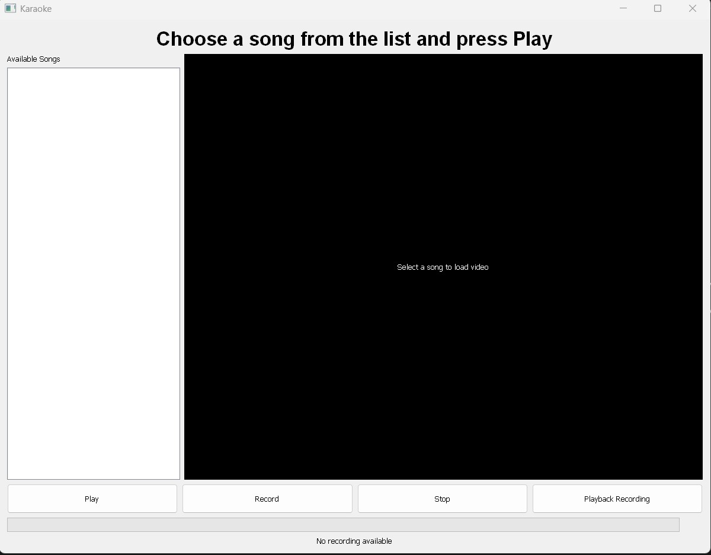

# Pitch-Detecting Karaoke Machine
By Thanadetch (Detch) Mateedunsatits and Liam Bennicoff
## Description
It uses a pitch detection algorithm to score karaoke singing. It requires .wav or .mp4 files from the user, specifically covering the vocal tracks of the song to test (reference audio) and the user's singing (user audio). It will score them from 50 to 100, purely on pitch. It uses the MIDI scale and has two levels of sensitivity, with one meant for beginners and another for those who are confident at singing. The sensitivity of the model and scoring system can be changed in karaoke_scorer.py. It also has a GUI to browse all tracks loaded into the program, as well as built-in recording, scoring, MIDI score over time, and playback features. 

## Features

1. Play, to play the video file. 
2. Record, to play and record the video file.
3. Stop/Pause, to stop the video file. The button shows up as pause if the video is already being played.
4. Playback, to play back the user's singing overlayed on the musical back track.
5. Score, displays a score from 50 to 100 depending on how well you sung.
6. Waveform viewer, display a waveform generator of the user's singing as well as the vocal track.

## Installation Instructions
1. It is recommened to use Python 3.13.0 as that was the version the development team used
2. `pip install -r requirements.txt`
3. Check requirements are fufilled by heading over to the tests folders and running import_check
4. 

## Getting Started and file requirements (PLEASE READ THIS!)

1. Getting your first audiofile
2. Setting up your song backtrack list
3. Setting up your song vocal list

## Recording your first recording
1. Click the record button 

## Unit Testing
### Karaoke Scorer and Scoring system
- Download itim_perfect.wav (sample user audio) needed to test.
- Find an acapella cover of Perfect by Ed Sheeran and convert it to a .wav file using the method mentioned above.
- Rename the file to PerfectVocals or adjust the filename in karaoke_scorer_test.py to align with whatever filename you chose
- Run the karaoke_scorer_test file
- To test out the system more, the user can find and record a variety of test files aganist a song's vocal reference files.
### Main MVC tests
- Located in the tests folder
- Adjust the filepath in the media_test files to adjust for the various songs the user wants to test out.
## Known issues and fixes
1. If you're an Oliner, using an Olin laptop, or using the laptop recording device and listening to it without a headphone, the speaker background noise will intrude on the audio file causing the analysis to be errorneous if using the vocals track. Opt to use a full MV version as the reference if you're doing this. The user could also resolve this issue by using headphones while recording.